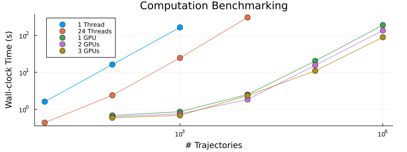
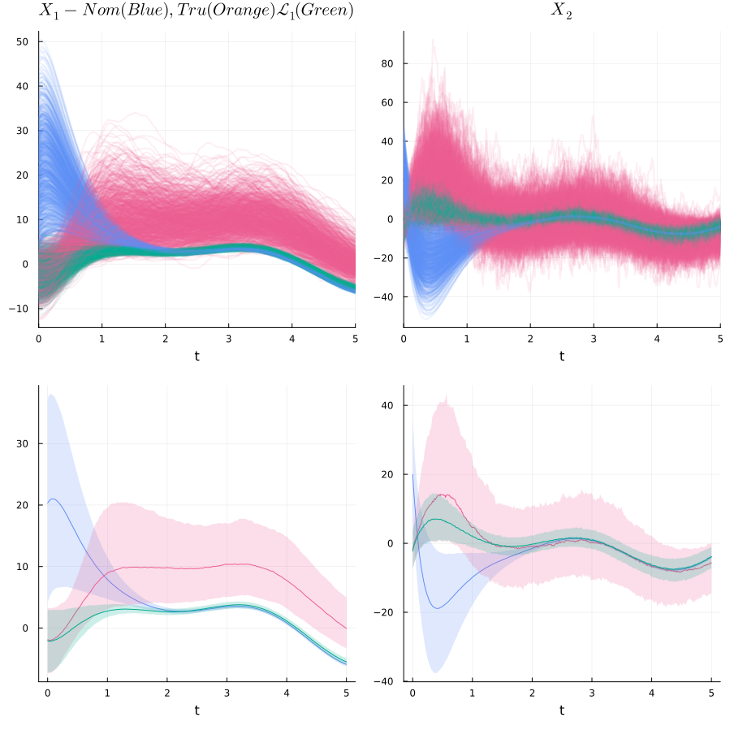

> ### *Under active development*

# *L1DRAC*

[](https://github.com/AdityaGahlawat/L1DRAC.jl/actions/workflows/ci.yml?query=branch%3Amain)
[](https://codecov.io/gh/AdityaGahlawat/L1DRAC.jl)

## Table of Contents
- [Description](#descrrption)
- [Installation](#installation)
- [Project Structure](#project-structure)
- [Benchmarks](#benchmarks)
- [Example](#example)
- [TODO](#todo)

### Description

Package for the numerical implementation of **$\mathcal{L}_1$ Distributionally Robust Adaptive Control ($\mathcal{L}_1$-DRAC)**. Find out more about it in our [paper](https://adityagahlawat.github.io/Preprints/DRAC.pdf):
```
@article{gahlawat2025DRAC,
  title={$\mathcal{L}_1$-DRAC: Distributionally Robust Adaptive Control},
  author={Gahlawat, Aditya and Karumanchi, Sambhu and Hovakimyan, Naira},
  journal={arXiv preprint TBD},
  year={2025}
}
```


### Installation
Start Julia with [multi-threading](https://docs.julialang.org/en/v1/manual/multi-threading/) 
```bash
$ julia -t auto  
# or  
$ julia -t <num threads>
```
Add package 
```julia
julia> ] add https://github.com/AdityaGahlawat/L1DRAC.jl
julia> ] Threads.nthreads() # verify num threads
```

### Project Structure

```
L1DRAC/
├── airlock/          # Work-in-progress code (not yet integrated)
├── archive/          # Deprecated/old code for reference
├── benchmark/        # Performance benchmarks
├── examples/
│   └── ex1/
├── sandbox/          # Development scratch work
├── src/              # Main package source
│   ├── L1DRAC.jl           # Main module
│   ├── types.jl            # Type definitions
│   ├── auxiliary.jl        # Backend selection & cleanup functions
│   ├── run_simulations.jl  # High-level simulation runner
│   ├── nominal_system.jl   # NominalSystem simulation (CPU + GPU)
│   ├── true_system.jl      # TrueSystem simulation (CPU + GPU)
│   └── L1_system.jl        # L1-DRAC simulation (CPU + GPU)
├── test/             # Package tests (runtests.jl)
├── writeups/         # Documentation and derivations
├── LICENSE
├── Manifest.toml
├── Project.toml
└── README.md
```

### Benchmarks



Computation time benchmark on a simple 2-D system.

**Source:** [`benchmark/benchmark_baseline_Mk3.jl`](benchmark/benchmark_baseline_Mk3.jl)

**Hardware:** Intel i9-10920X (24 threads), 3x NVIDIA RTX A4000 (16GB each)


### Example 
**Source:** [`examples/ex1/doubleintegrator1D.jl`](examples/ex1/doubleintegrator1D.jl)
```julia
using L1DRAC
using CUDA
using LinearAlgebra
using Distributions
using ControlSystemsBase
using StaticArrays
using Plots

###################################################################
## SYSTEM SETUP
###################################################################
function setup_system(; Ntraj=10) # Ntraj = number of trajectories for ensemble sims, default val 10
    # Simulation Parameters
    tspan = (0.0, 5.0)
    Δₜ = 1e-4 # Time step size
    Δ_saveat = 1e2 * Δₜ # Needs to be an integer multiple of Δₜ
    simulation_parameters = sim_params(tspan, Δₜ, Ntraj, Δ_saveat)

    # System Dimensions
    n, m, d = 2, 1, 2
    system_dimensions = sys_dims(n, m, d)

    # Double integrator dynamics
    A = @SMatrix [0.0 1.0; 0.0 0.0]
    B = @SMatrix [0.0; 1.0]

    # Baseline controller via pole placement
    λ = 10.0 # Stability margin
    sys = ss(A, B, SMatrix{2,2}(1.0I), 0.0)
    K = SMatrix{1,2}(place(sys, -λ * ones(2)))
    dp = (; K) # Dynamics params for GPU

    function baseline_input(t, x, dp) # Tracking controller
        r = @SVector [5*sin(t) + 3*cos(2*t), 0.0] # Reference trajectory
        return dp.K * (r - x)
    end

    # Nominal Vector Fields
    f(t, x, dp) = A * x + B * baseline_input(t, x, dp)
    g(t, x, dp) = @SVector [0.0, 1.0]
    g_perp(t, x, dp) = @SVector [1.0, 0.0]

    p_um(t, x, dp) = 2.0 * @SMatrix [0.01 0.1]
    p_m(t, x, dp) = 1.0 * @SMatrix [0.0 0.8]
    p(t, x, dp) = vcat(p_um(t, x, dp), p_m(t, x, dp))

    nominal_components = nominal_vector_fields(f, g, g_perp, p, dp)

    # Uncertain Vector Fields
    Λμ_um(t, x, dp) = 1e-2 * (1 + sin(x[1]))
    Λμ_m(t, x, dp) = 1.0 * (5 + 10*cos(x[2]) + 5*norm(x))
    Λμ(t, x, dp) = @SVector [Λμ_um(t, x, dp), Λμ_m(t, x, dp)]

    Λσ_um(t, x, dp) = 0.0 * @SMatrix [0.1+cos(x[2]) 2.0]
    Λσ_m(t, x, dp) = @SMatrix [0.0 5+sin(x[2])+
                        5.0*(norm(x) < 1 ? norm(x) : sqrt(norm(x)))]
    Λσ(t, x, dp) = vcat(Λσ_um(t, x, dp), Λσ_m(t, x, dp))

    uncertain_components = uncertain_vector_fields(Λμ, Λσ)

    # Initial Distributions
    nominal_ξ₀ = MvNormal(1e-2 * ones(2), 1.0 * I(2))
    true_ξ₀ = MvNormal(-1.0 * ones(2), 1e-1 * I(2))
    initial_distributions = init_dist(nominal_ξ₀, true_ξ₀)

    # Define Systems
    nominal_system = nom_sys(system_dimensions, nominal_components, 
                        initial_distributions)
    true_system = true_sys(system_dimensions, nominal_components, 
                        uncertain_components, initial_distributions)

    # L1-DRAC Parameters (PLACEHOLDER values)
    ω = 50.0 # Filter bandwidth
    Tₛ = 10 * Δₜ # Sample time (integer multiple of Δₜ)
    λₛ = 100.0 # Predictor stability
    L1params = drac_params(ω, Tₛ, λₛ)

    return (
        simulation_parameters = simulation_parameters,
        nominal_system = nominal_system,
        true_system = true_system,
        L1params = L1params
    )
end
```
- ### Number of trajectories
    - `Ntraj = Int(#)` 
    - If `Ntraj > 1`, then `src/run_simulations.jl` auto selects `simtype = :ensemble` 
- ### Systems to be simulated
    - Allows users to either individually simulate `:nominal_sys`, `true_sys`, and `L1_sys` or any combination of thereof 
    - e.g., `systems=[:nominal_sys, :true_sys, :L1_sys]`, `systems=[:nominal_sys, :true_sys]`, ``systems=[:L1_sys]`` 
- ### Assigned computational resources
    - User input `max_GPUs = Int(>= 0)`
        - `max_GPUs = 0` → Force CPU only (uses multi-threading via `EnsembleThreads`)
        - `max_GPUs = 1` → Use single GPU if available, else fall back to CPU (default)
        - `max_GPUs = N` → Use up to N GPUs (via `@async` and manual batching)
    - **Overassignment protection:** The package detects available GPUs automatically via `CUDA.devices()`. The actual number used is `numGPUs = min(max_GPUs, available_GPUs)`. 
        - If you set `max_GPUs = 1` but have no GPUs, it automatically falls back to `numGPUs = 0` (CPU).
        - If you set `max_GPUs =5` but have 3 GPUs, it automatically assigns `numGPUs = 3`.

```julia 
    ###################################################################
    ## MAIN
    ###################################################################
    function main(; Ntraj = Int(1e1), max_GPUs=10, 
                        systems=[:nominal_sys, :true_sys, :L1_sys]) 
        @info "Warmup run for JIT compilation"
        println("=====================================") 
        warmup_setup = setup_system(; Ntraj = 10)
        run_simulations(warmup_setup; max_GPUs=max_GPUs, systems=systems);

        println("=====================================")
        @info "Complete run for Ntraj=$Ntraj" 
        println("=====================================")
        setup = setup_system(; Ntraj = Ntraj)
        solutions = run_simulations(setup; max_GPUs=max_GPUs, systems=systems)
        return solutions, systems
    end

    nominal_sol, true_sol, L1_sol = main();
```
### Notes: 
- `Warmup` for JIT compilaaion
- `@CUDA.time()` for GPU solvers, and at the end `GC.gc()` and `CUD.reclaim()` to free up CPU and GPU memory. 
- Solutions returned for each system are 
    - `Vector{<:RODESolution}` for a single trajectory
    - `Vector{<:EnsembleSolution}` with `length = N`, `N = 1` when using CPU or single GPU, and `N = # of GPUs` used



## TODO
- Add explanation of solution vector for L1 = `[x, xhat, Lambda_hat, Filter-state]`
- Cleanup for registration with @JuliaRegistrator
- Parallelized plot utilities (multithreading loops/?)
- Control logging 
    - Baseline 
    - L1
    - Total
- Parallelized empirical distributions
- warmup with flag `warmup=:true`
- Sharper bounds computation
- Manually serialize batches for required mem > available mem on GPUs
- Add ```struct``` wrappers to auto extend necessary function signatures to the complete ```(t,x,dynamics_params)``` for GPU computation. 
    - E.g, ```g(t) -> g(t,x,dynamics_params)```.

---


