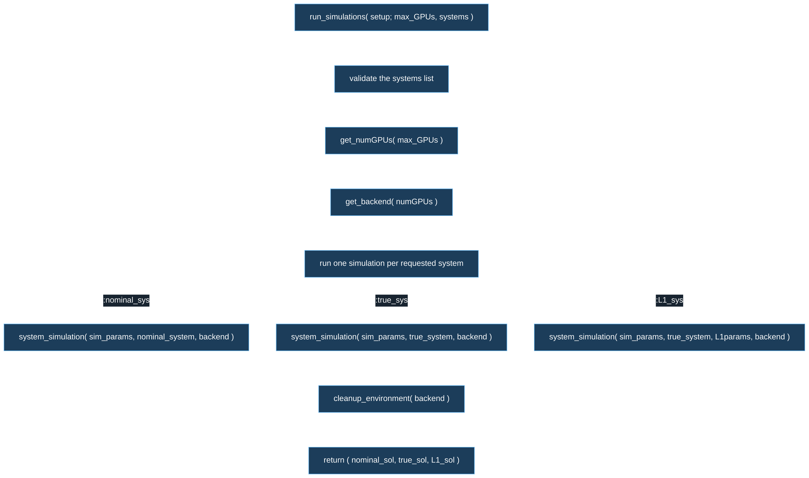
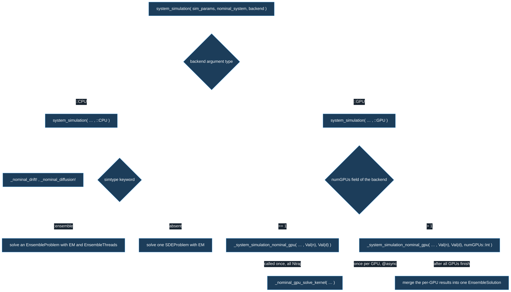
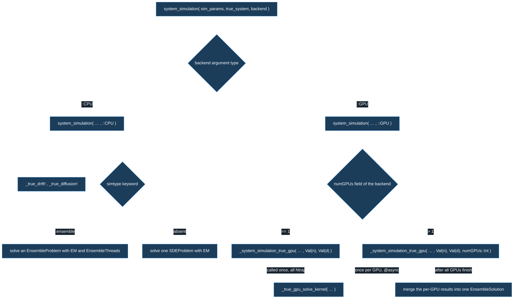
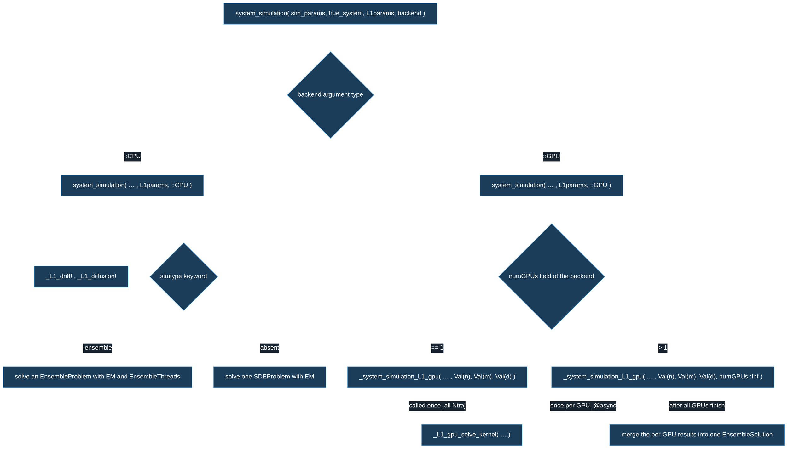
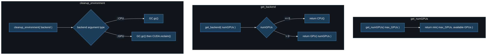

# L1DRAC Call Flows

A standing reference for the call structure of the `src/` files of L1DRAC. For each source file there is one flowchart. Find the file you are editing in the table below, jump to its chart, and read: the boxes above yours are who calls you; the boxes below are whom you call; a diamond is a branch, with the deciding condition written on the arrows leaving it.

Scope is `src/` only. Nothing here concerns `examples/` or plotting. `types.jl` and `L1DRAC.jl` hold only struct/type definitions and the module's `export` list, so they have no chart.

## Which file, which chart

| File (your editor tab) | Chart |
|---|---|
| `run_simulations.jl` | [run_simulations.jl](#run_simulationsjl) |
| `nominal_system.jl` | [nominal_system.jl](#nominal_systemjl) |
| `true_system.jl` | [true_system.jl](#true_systemjl) |
| `L1_system.jl` | [L1_system.jl](#l1_systemjl) |
| `data_logging.jl` | [data_logging.jl](#data_loggingjl) |
| `auxiliary.jl` | [auxiliary.jl](#auxiliaryjl) |
| `types.jl`, `L1DRAC.jl` | no chart — type definitions and exports only |

## How to read these charts

- A rounded box is a function or a concrete step. A diamond is a branch point; the arrows leaving it are labelled with the condition that chooses each way out.
- A branch is one of two things. Either Julia is choosing a **method** by the **types of the arguments** (multiple dispatch), or a plain `if` inside one method is choosing on a **value** or a **keyword**. The arrow label tells you which condition applies.
- The core routing story is dispatch. When several boxes carry the **same function name**, the argument that differs between their signatures is what routes the call. Three such routes recur here:
  - the backend argument type — `::CPU` versus `::GPU` — picks the method inside each system file;
  - the presence of the `numGPUs::Int` argument picks the multi-GPU method of `_system_simulation_*_gpu` over the single-GPU one;
  - the extra `L1params` argument is what sends a call into `L1_system.jl` instead of `true_system.jl`.
- Function names only, never line numbers. Line numbers move on every edit; names move only on a rename.
- Charts render at full size, so the wide ones extend past the pane. To pan sideways, hover over the chart and scroll with Shift + mouse wheel (trackpad: two fingers sideways).

---

## run_simulations.jl

- `get_numGPUs`, `get_backend` and `cleanup_environment` live in `auxiliary.jl`.
- `CN` resolves inside `nominal_system.jl`, `CT` inside `true_system.jl`, `CL` inside `L1_system.jl`. The extra `L1params` argument on `CL` is what routes it to `L1_system.jl` rather than `true_system.jl`.
- `backend` is `CPU()` or `GPU(numGPUs)`; both are passed the same way here. The CPU-versus-GPU split does not happen in this file — it happens by dispatch inside each system file.
- If `setup.simulation_parameters.Ntraj > 1`, the keyword `simtype=:ensemble` is added to every call; with `Ntraj == 1` a single trajectory is run. This is a keyword on the call, not a branch in the call graph.
- Requesting `:L1_sys` without `setup.L1params`, or naming a system that is not `:nominal_sys` / `:true_sys` / `:L1_sys`, errors during validation. Each system runs only if it appears in `systems`; a system left out returns `nothing`.

---

## nominal_system.jl

- Called by `run_simulations` for `:nominal_sys`. Two methods share the name `system_simulation`; the type of the third argument picks the method.
- Inside the GPU method, the value of `numGPUs` picks between two methods of `_system_simulation_nominal_gpu`; the one carrying the `numGPUs::Int` argument is the multi-GPU method. `_nominal_gpu_solve_kernel` is shared — both the single- and multi-GPU methods call it.
- The kernel solves with `GPUEM()` and `EnsembleGPUKernel(CUDA)` at a fixed `dt`. The multi-GPU split is weighted: GPU 0 takes a half share of the trajectories.
- Returns: the CPU ensemble branch and both GPU paths return an `EnsembleSolution`; the CPU single-trajectory branch returns one solution.

---

## true_system.jl

- Called by `run_simulations` for `:true_sys`. Same shape as `nominal_system.jl`; the difference is the drift and diffusion. `_true_drift!` and `_true_diffusion!` form the drift and diffusion from the nominal fields plus the uncertainty fields; the GPU kernel `_true_gpu_solve_kernel` does the same, adding `Λμ` and `Λσ` inside its own drift and diffusion.
- `_true_gpu_solve_kernel` is shared by the single- and multi-GPU methods. The multi-GPU split is weighted: GPU 0 takes a half share.
- Returns: the CPU ensemble branch and both GPU paths return an `EnsembleSolution`; the CPU single-trajectory branch returns one solution.

---

## L1_system.jl

- The methods in this file are the ones carrying the extra `L1params::L1DRACParams` argument. That argument is what routes `run_simulations`' `:L1_sys` call here rather than into `true_system.jl`, whose `system_simulation` has no `L1params`.
- The state solved and saved here is the extended state `Z = [X, Xhat, Xfilter, Λhat]`, length `3n + m`. The full extended state is carried through, not just `X`.
- `_L1_gpu_solve_kernel` is shared by the single- and multi-GPU methods, and defines its own `drift_L1_gpu` and `diffusion_L1_gpu` inline. The multi-GPU split is weighted: GPU 0 takes a half share.
- Returns: the CPU ensemble branch and both GPU paths return an `EnsembleSolution`; the CPU single-trajectory branch returns one solution.

---

## data_logging.jl

```mermaid
%%{init: {"theme":"base","flowchart":{"useMaxWidth":false,"htmlLabels":true,"wrappingWidth":3000,"nodeSpacing":55,"rankSpacing":70},"themeVariables":{"background":"#0d1117","mainBkg":"#1c3d5a","primaryColor":"#1c3d5a","primaryTextColor":"#ffffff","primaryBorderColor":"#63b3ed","lineColor":"#ffffff","textColor":"#ffffff","edgeLabelBackground":"#182430","clusterBkg":"#11161d","clusterBorder":"#3a4a5a","tertiaryColor":"#11161d","secondaryColor":"#243b53"}}}%%
flowchart TD
  subgraph SLG["state_logging"]
    SL["state_logging( system_dimensions; sol_nominal, sol_true, sol_L1, path )"]
    SLN["_process_solution( sol_nominal )"]
    SLT["_process_solution( sol_true )"]
    SLL["_process_solution_L1( sol_L1, system_dimensions )"]
    JN["jldsave states_nominal.jld2 with keys t and u"]
    JT["jldsave states_true.jld2 with keys t and u"]
    JL["jldsave states_L1.jld2 with keys t and u"]
    SLR["return ( nominal, true_sys, L1 ) file paths"]
    SL -->|"sol_nominal provided"| SLN --> JN --> SLR
    SL -->|"sol_true provided"| SLT --> JT --> SLR
    SL -->|"sol_L1 provided"| SLL --> JL --> SLR
  end

  subgraph LEG["load_ensemble"]
    LE["load_ensemble( path; component, system_dimensions )"]
    CMP{"component keyword"}
    VER["use each saved state vector as-is"]
    G1{"component is one of the four L1 selectors"}
    G2{"system_dimensions was given"}
    G3{"saved state length == 3n+m"}
    E1["error: unknown component"]
    E2["error: a selector needs system_dimensions"]
    E3["error: L1 selector used on a nominal or true file"]
    RES["resolve the selector to an index range, then slice each state to it"]
    BLD["rebuild each trajectory: build_solution over a stub SDEProblem with a LinearInterpolation"]
    LER["return an EnsembleSolution of per-trajectory solutions"]
    LE --> CMP
    CMP -->|"nothing"| VER
    CMP -->|"a Symbol"| G1
    G1 -->|"no"| E1
    G1 -->|"yes"| G2
    G2 -->|"no"| E2
    G2 -->|"yes"| G3
    G3 -->|"no"| E3
    G3 -->|"yes"| RES
    VER --> BLD
    RES --> BLD
    BLD --> LER
  end
```

- `state_logging` is called on the NamedTuple that `run_simulations` returns. Each solution is saved only if it was provided (non-`nothing`). Nominal and true solutions go through `_process_solution`; the L1 solution goes through `_process_solution_L1`, which saves the full extended state (length `3n + m`) verbatim. Every file uses the same two-key `{t, u}` schema.
- `load_ensemble` reads such a file back into a genuine `EnsembleSolution` with no re-simulation. With no `component`, the file loads verbatim: nominal and true as saved, an L1 file on its full extended state. With a `component`, the three guards run before the slice — each errors loudly.
- The four L1-only selectors and the blocks of `Z = [X, Xhat, Xfilter, Λhat]` they address: `:L1_sys_states → X`, `:L1_predictor → Xhat`, `:L1_filter → Xfilter`, `:L1_adaptive_estimate → Λhat`.

---

## auxiliary.jl

- All three functions are called by `run_simulations`. `get_numGPUs` caps the request to the number of CUDA devices (and warns if the request exceeds it). `cleanup_environment` has two methods; the backend argument type picks which one runs.

---

## Settings

Every chart carries the **same** init directive on its first line, byte-for-byte identical, so a colour change is one find-and-replace across the whole file. Each knob below names a value inside that directive; change it in one chart and paste the new directive into the others, or find-and-replace the old hex with the new one everywhere.

| Knob | What it changes on screen | How to change it |
|---|---|---|
| `lineColor` | The colour of every arrow and every arrowhead. | Replace its hex (`#ffffff`). Keep it bright against the dark page. |
| `primaryColor` and `mainBkg` | The fill inside every box and every diamond. | Replace both hexes (both `#1c3d5a`) with the same new value. Keep it clearly darker than the text. |
| `primaryTextColor` and `textColor` | The text inside boxes, and the text on arrows. | Replace both hexes (both `#ffffff`). Keep it much lighter than the box fill. |
| `primaryBorderColor` | The outline around every box and diamond. | Replace its hex (`#63b3ed`). |
| `edgeLabelBackground` | The small background patch behind text that sits on an arrow. | Replace its hex (`#182430`). Keep it dark so the light label text stays readable. |
| `rankSpacing` | The vertical gap between rows of boxes (raise it if arrows feel cramped). | Replace the number (`70`). |

The palette is built for a dark editor background only. If you move to a light background, at minimum flip `primaryTextColor`/`textColor` to a dark hex, `lineColor` to a dark hex, and `primaryColor`/`mainBkg` to a light hex — otherwise light text will land on a light page.

## Keeping these charts current

These charts track structure, not text. Update a file's chart only when the **call structure** of that file changes: a method added or removed, a call added or removed, a dispatch or `if` condition changed, or the return target changed. Renaming a function means renaming its box. Editing the body of a function without changing what it calls, or what selects it, needs no change here. There are no line numbers in any chart, by design — so ordinary edits never rot them.